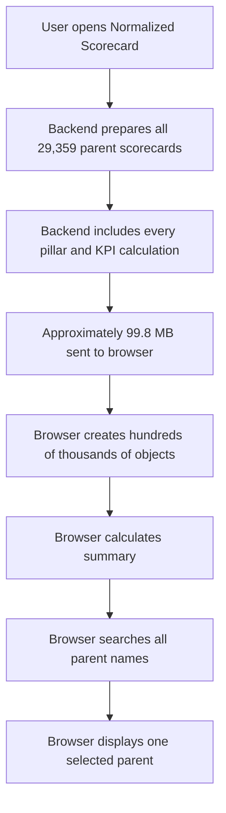
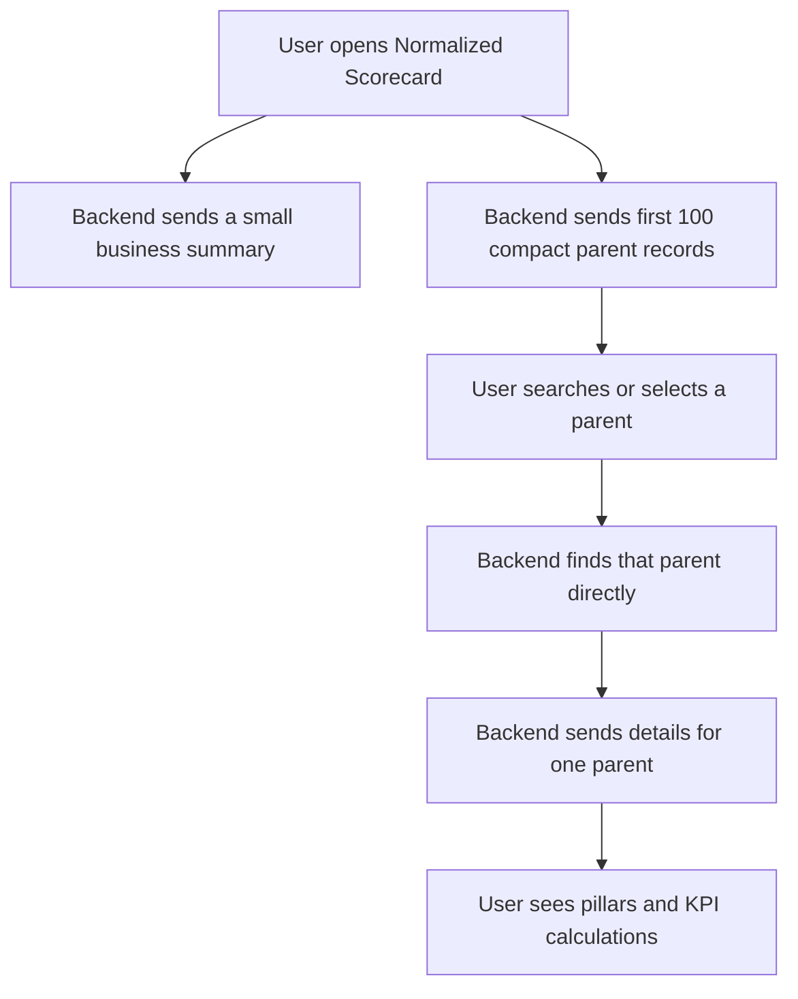
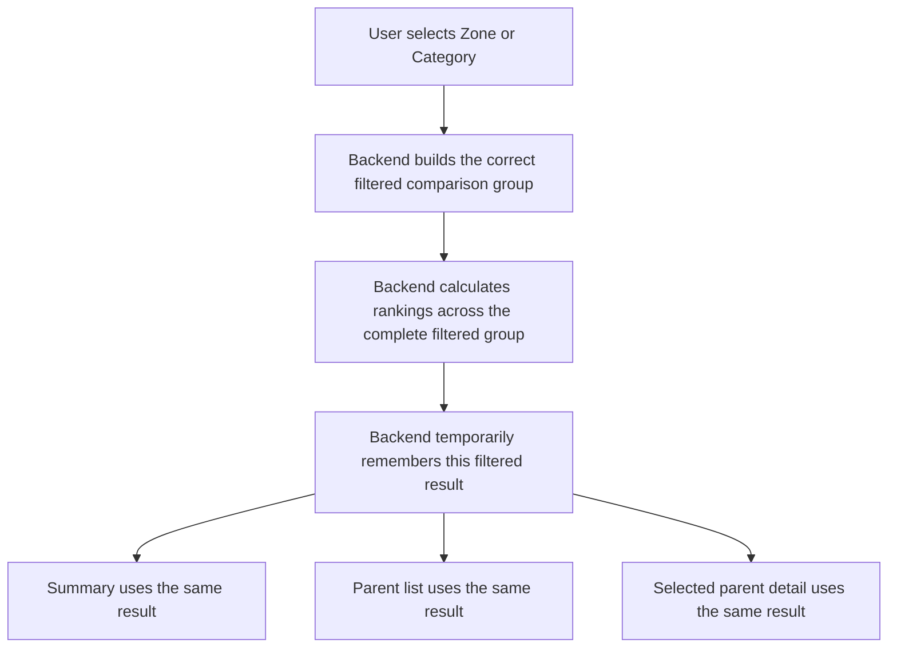

# Phase 2: Normalized Scorecard Performance Improvement

## Non-Technical Guide

Date: 2026-08-04  
Audience: Business users, project owners, testers, and other non-technical stakeholders

## Executive Summary

The Normalized Scorecard became slow after the refreshed data increased from approximately 3,000 parent suppliers to approximately 29,000 parent suppliers.

The 29,000-parent population is correct. The problem was not bad data. The problem was that the application was sending the complete calculation details for every parent supplier to the user's browser, even though the user normally views only one parent at a time.

Phase 2 changed how information is delivered:

- The first screen now receives only a small summary.
- The application initially receives only 100 compact parent records.
- Parent search returns a maximum of 30 matching names.
- Detailed KPI calculations are loaded only for the selected parent.
- A complete CSV is generated only when the user clicks Export.

The business calculations were not changed.

## Simple Analogy

Imagine a filing room containing 29,000 supplier folders.

### Old Approach

When someone asked to see one supplier, the filing-room employee delivered all 29,000 folders, including every calculation page inside every folder.

The user then had to:

- Wait for all folders to arrive.
- Find space for all folders.
- Search through all folders.
- Open the one folder they actually needed.

### New Approach

The filing-room employee now provides:

- A one-page summary of the complete filing room.
- A short list of the first 100 suppliers.
- Up to 30 matching names when the user searches.
- The complete folder for only the selected supplier.
- All folders only when a complete export is explicitly requested.

The contents of each supplier folder are unchanged. Only the delivery process has changed.

## Old Flow



In simple terms:

```text
User asks for one screen
        |
        v
Application sends everything
        |
        v
Browser searches and calculates locally
        |
        v
User finally sees one parent
```

## New Flow



In simple terms:

```text
User opens the page
        |
        +--> Small summary
        |
        +--> First 100 parent names and scores
        |
        v
User selects one parent
        |
        v
Only that parent's complete details are sent
```

## Old Versus New

| Area | Old Behavior | New Behavior |
|---|---|---|
| Initial page load | Loaded complete details for approximately 29K parents | Loads summary plus 100 compact parents |
| Parent search | Browser searched all 29K parents | Backend returns maximum 30 matches |
| Parent selection | Browser scanned a very large list | Backend finds the parent directly |
| KPI details | Loaded for every parent | Loaded only for selected parent |
| Summary figures | Browser calculated them after receiving all data | Backend sends completed summary figures |
| Parent dropdown | Could contain approximately 29K options | Contains at most 100 initial options or 30 search matches |
| Export | Complete data had to be in browser memory first | Backend generates complete CSV only when requested |
| Zone/category filtering | Could trigger repeated calculation and large responses | One filtered result is reused for related requests |
| Maintenance control | Rebuild Cache button visible in frontend | Button removed; maintenance remains internal |
| Scorecard formulas | Existing formulas | Unchanged |

## What Information Is Sent Initially

The initial summary includes only information such as:

- Number of matching parent suppliers
- Average normalized score
- Average coverage
- Number of Green suppliers
- Number of Amber suppliers
- Number of Red suppliers
- Date and time when the scorecard cache was built

The first compact parent list contains only information such as:

- Parent supplier name
- Normalized score
- Coverage
- Coverage-adjusted score
- Invoice value
- Green, Amber, or Red band
- Compact pillar percentages

It does not contain the complete KPI calculation breakdown for all parents.

## What Is Loaded After Parent Selection

When the user selects one parent supplier, the backend returns the complete scorecard for that parent only.

This includes:

- Normalized score
- Coverage
- Coverage-adjusted score
- Applicable pillar weight
- Total earned points
- Complete pillar calculations
- Individual KPI calculations
- KPI raw values
- KPI attainment
- KPI percentile
- KPI earned score
- KPI applicability
- KPI floor and target

This allows the detailed screen and applicability overrides to continue working as before.

## Parent Search Flow


The short wait prevents a new request for every individual keystroke. For example, when typing `Brewing`, the application waits briefly rather than making seven immediate searches.

## Export Flow

### Old Export

```text
Load all parent details into browser
        |
        v
Keep all data in browser memory
        |
        v
Create CSV in browser
```

### New Export

```text
User clicks Export
        |
        v
Backend reads the complete matching scorecard
        |
        v
Backend sends CSV progressively
        |
        v
Browser downloads the file
```

The technical term for progressively sending the CSV is "streaming." It means the backend does not need to build one giant text file in browser memory before the download begins.

## Zone and Category Filter Flow

Zone and category filters affect the comparison population and can therefore affect ranking and percentile calculations.

For that reason, the application does not calculate one parent in isolation.



This is important because a parent's percentile must be based on the complete filtered group, not just the first 100 displayed parents.

The backend currently remembers the most recently used filtered group. This gives good POC performance without keeping several very large filtered datasets in memory.

## Backend Changes in Simple Terms

### 1. Compact Parent List

The backend creates a short version of each parent scorecard for lists and searches.

The short version does not include all KPI details.

### 2. Direct Parent Index

Previously, finding one parent could require checking records one by one.

The backend now creates something similar to an alphabetical index in a book:

```text
Parent name --> Complete parent scorecard
```

This allows the application to find a selected parent directly.

### 3. Backend Summary

The backend calculates the overall counts and averages once and sends the completed summary to the browser.

The browser no longer needs all 29K detailed parents just to calculate five summary numbers.

### 4. Pagination

The backend divides the parent list into pages.

The first request returns 100 parents. The backend supports additional pages without returning the complete population at once.

### 5. Bounded Search

The backend searches the complete parent population but returns only the first 30 matches.

### 6. One-Parent Detail

The backend returns complete pillars and KPI calculations only for the selected parent.

### 7. On-Demand Export

The backend generates the complete CSV only after the user requests it.

### 8. Precomputed Filter Options

Zone and category names are prepared when the scorecard cache is built.

The backend no longer scans all raw KPI rows each time the scorecard page asks for filter options.

### 9. Filtered-Group Memory

The backend temporarily remembers the most recently calculated zone/category group.

The summary, parent list, and selected-parent detail can then reuse the same calculation.

### 10. Legacy Compatibility

The original complete scorecard service still exists for compatibility and troubleshooting.

The optimized frontend no longer calls it during normal use.

## Performance Result

Measurements were taken using the actual refreshed population of 29,359 parents.

| Response | Approximate backend time | Uncompressed size |
|---|---:|---:|
| Old complete scorecard | 2.38 seconds | 99.8 MB |
| New summary | 0.018 seconds | 274 bytes |
| New first 100 parents | 0.039 seconds | 27 KB |
| New parent search | 0.039 seconds | 2.7 KB |
| New selected-parent detail | 0.0002 seconds | 5.7 KB |

The normal initial data transfer was reduced from approximately 99.8 MB to approximately 33 KB.

This is approximately a 99.97% reduction in uncompressed application data.

## What Did Not Change

Phase 2 did not change:

- Databricks source data
- Number of parent suppliers
- KPI formulas
- KPI floor and target values
- KPI maximum scores
- KPI direction rules
- Parent aggregation rules
- Rank and percentile rules
- Pillar weights
- Coverage formula
- Normalized-score formula
- Green, Amber, and Red rules
- Applicability override behavior

The objective was to deliver the same results more efficiently.

## What Users Should Notice

Users should notice:

- Faster initial page loading
- Faster parent selection
- A smaller and more useful parent list
- Search results appearing after a short pause
- Less browser lag
- Lower browser memory usage
- Export beginning as a backend download

Users should not notice a change in calculated scores.

## Internal Maintenance

The frontend previously displayed a Rebuild Cache button. It has been removed because cache rebuild and data refresh are internal maintenance activities.

The internal backend rebuild capability remains available for the developer or data-refresh workflow.

End users are not given Databricks credentials or a Databricks refresh option.

## Validation Completed

The following checks were completed:

- Frontend production build passed.
- 52 fast backend and Phase 2 tests passed.
- The full backend suite reported 55 passed and 1 failed.
- All 332,632 KPI-level calculation checks passed.
- No Phase 2 endpoint test failed.

The remaining full-suite failure relates to the previously known normalized-score rounding reconciliation. One example is application score `9.67` compared with independent validation score `9.68`.

This discrepancy was present before the delivery optimization and is not caused by the new data flow.

## Business UAT Checklist

Before starting Phase 3, business or project UAT should confirm:

1. The global Normalized Scorecard opens successfully.
2. Summary counts look reasonable for approximately 29K parents.
3. Known parent suppliers can be found through search.
4. Selecting a parent displays its complete pillar and KPI details.
5. Known normalized scores match expected results.
6. Zone filtering produces the expected comparison population.
7. Category filtering produces the expected comparison population.
8. Applicability overrides still update the selected score immediately.
9. Clear Filters returns to the global view.
10. Complete and filtered CSV exports download successfully.

## Frequently Asked Questions

### Did we remove any suppliers?

No. The approximately 29K-parent population is retained.

### Did we simplify or change the score calculation?

No. The calculation logic is unchanged.

### Why are only 100 parents initially visible?

The first 100 records provide a fast starting list. Search can find any parent from the complete population.

### Does search check only the first 100 parents?

No. The backend searches the complete active parent population and returns up to 30 matches.

### Are KPI details still available?

Yes. Complete KPI details are loaded for the selected parent.

### Is the complete CSV still available?

Yes. It is now generated by the backend only when requested.

### Does a zone or category filter calculate percentiles using only 100 parents?

No. Rankings and percentiles are calculated over the complete filtered comparison group. Pagination is applied only after the business calculations are complete.

### Why does the first filtered request sometimes take longer?

A new zone/category combination may require the backend to build the correct filtered comparison group. Related requests then reuse that filtered result.

### Why was the Rebuild Cache button removed?

Data refresh and cache maintenance are internal operational responsibilities, not end-user actions.

## Phase 2 Conclusion

Phase 2 solved the largest Normalized Scorecard latency problem by changing the delivery approach from "send everything" to "send only what is needed now."

The application still supports all 29K parents and retains the same scorecard calculation rules. The next step is business UAT. Phase 3 should begin only after the Phase 2 user flow and results are confirmed.
