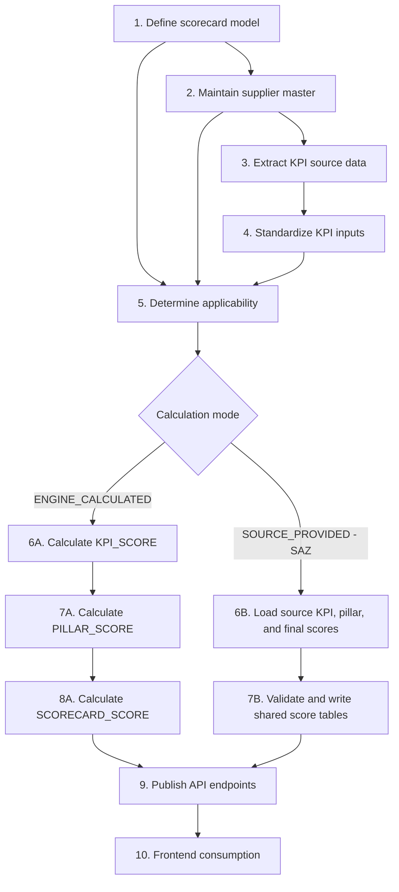

# Generic SPM KPI Table Schema

## Purpose

This design makes SPM reusable inside a larger product. Adding a KPI should require configuration and fact-data onboarding, while the scorecard service calculates KPI, pillar, and overall scores generically. It also supports scorecards, such as SAZ, where an upstream source provides all KPI, pillar, and final scores.

The source-of-truth layers and score outputs are tables. The scoring job may use SQL views internally, but the frontend consumes API responses only; it must not recreate score calculations.

---

## Data Model Principles

- **Configuration is data, not application code.** New KPIs, targets, weights, and zone scope are maintained in configuration tables.
- **Raw KPI facts use a long format.** One row represents one supplier, one KPI, and one reporting period.
- **The parent supplier is the scorecard roll-up key.** A vendor can have many records, but its parent has one scorecard per reporting period.
- **Applicability is explicit.** A row marked `Not Applicable` is excluded from score and coverage calculations. An absent row is treated as missing expected data and reduces coverage.
- **Derived values are never entered manually.** Attainment, earned points, pillar scores, normalized score, coverage, and coverage-adjusted score are calculated in views.
- **Each scorecard has one calculation authority.** `ENGINE_CALCULATED` scorecards use the generic rules; `SOURCE_PROVIDED` scorecards store validated upstream results without recalculation.

---

## Entity Relationship Diagram

```mermaid
erDiagram
    SCORECARD_DEFINITION ||--o{ PILLAR_DEFINITION : contains
    PILLAR_DEFINITION ||--o{ PILLAR_APPLICABILITY_RULE : applies_to
    PILLAR_DEFINITION ||--o{ KPI_DEFINITION : contains
    KPI_DEFINITION ||--o{ KPI_VERSION : has_rules
    KPI_VERSION ||--o{ KPI_SCOPE : applies_to
    SUPPLIER ||--o{ KPI_INPUT : provides
    SUPPLIER ||--o{ SUPPLIER_SPEND : spends
    SUPPLIER ||--o{ PILLAR_INPUT : provides
    SUPPLIER ||--o{ SCORECARD_INPUT : provides
    KPI_VERSION ||--o{ KPI_INPUT : defines
    KPI_INPUT ||--o{ KPI_SCORE : produces
    PILLAR_INPUT ||--o{ PILLAR_SCORE : provides
    SCORECARD_INPUT ||--o{ SCORECARD_SCORE : provides
    KPI_SCORE ||--o{ PILLAR_SCORE : aggregates_to
    PILLAR_DEFINITION ||--o{ PILLAR_SCORE : weights
    PILLAR_SCORE ||--o{ SCORECARD_SCORE : aggregates_to

    SCORECARD_DEFINITION {
        string scorecard_id PK
        string scorecard_name
        string calculation_mode
        string calculation_frequency
        string scorecard_status
        date effective_from
        date effective_to
    }

    PILLAR_DEFINITION {
        string pillar_id PK
        string scorecard_id FK
        string pillar_name
        decimal pillar_weight
        boolean is_active
    }

    PILLAR_APPLICABILITY_RULE {
        string pillar_rule_id PK
        string pillar_id FK
        string attribute_name
        string operator
        string attribute_value
        boolean is_applicable
        date effective_from
        date effective_to
    }

    KPI_DEFINITION {
        string kpi_id PK
        string kpi_name
        string pillar_id FK
        string input_unit
        boolean is_active
    }

    KPI_VERSION {
        string kpi_version_id PK
        string kpi_id FK
        decimal max_score
        string scoring_method
        string direction
        decimal floor_value
        decimal target_value
        string period_granularity
        date effective_from
        date effective_to
    }

    KPI_SCOPE {
        string kpi_scope_id PK
        string kpi_version_id FK
        string scope_type
        string scope_value
        boolean is_applicable
        date effective_from
        date effective_to
    }

    SUPPLIER {
        string supplier_id PK
        string parent_supplier_id
        string parent_supplier_name
        string vendor_name
        string zone
        string country
        string company_code
        string vendor_account_number
        string gpo_category
        string sub_category
        string purchasing_category
        string scorecard_category
    }

    SUPPLIER_SPEND {
        string spend_id PK
        string supplier_id FK
        string parent_supplier_id
        string zone
        string country
        string gpo_category
        string purchasing_category
        string scorecard_category
        string sub_category
        date reporting_period
        decimal spend_amount
        string source_reference
    }

    KPI_INPUT {
        string kpi_input_id PK
        string supplier_id FK
        string parent_supplier_id
        string kpi_version_id FK
        string kpi_id FK
        string zone
        string country
        string gpo_category
        string purchasing_category
        string scorecard_category
        string sub_category
        date reporting_period
        string period_type
        date period_start_date
        date period_end_date
        decimal input_value
        decimal source_kpi_score
        string applicability_status
        string source_reference
        timestamp loaded_at
    }

    KPI_SCORE {
        string supplier_id FK
        string parent_supplier_id
        string kpi_version_id FK
        string zone
        string country
        string gpo_category
        string purchasing_category
        string scorecard_category
        string sub_category
        date reporting_period
        decimal raw_value
        decimal attainment
        decimal percentile
        decimal earned_points
        string score_status
        string calculation_source
    }

    PILLAR_INPUT {
        string pillar_input_id PK
        string supplier_id FK
        string parent_supplier_id
        string scorecard_id FK
        string pillar_id FK
        string zone
        string country
        string gpo_category
        string purchasing_category
        string scorecard_category
        string sub_category
        date reporting_period
        decimal source_pillar_score_pct
        decimal source_weighted_contribution
        decimal source_coverage_pct
        string source_reference
    }

    SCORECARD_INPUT {
        string scorecard_input_id PK
        string supplier_id FK
        string parent_supplier_id
        string scorecard_id FK
        string zone
        string country
        string gpo_category
        string purchasing_category
        string scorecard_category
        string sub_category
        date reporting_period
        decimal source_normalized_score
        decimal source_coverage_pct
        decimal source_coverage_adjusted_score
        string source_score_band
        string source_reference
    }

    PILLAR_SCORE {
        string supplier_id FK
        string parent_supplier_id
        string pillar_id
        string zone
        string country
        string gpo_category
        string purchasing_category
        string scorecard_category
        string sub_category
        date reporting_period
        decimal earned_points
        decimal applicable_max_points
        decimal pillar_score_pct
        decimal weighted_contribution
        decimal available_kpi_weight
        decimal expected_kpi_weight
        decimal coverage_pct
        string calculation_source
    }

    SCORECARD_SCORE {
        string supplier_id FK
        string parent_supplier_id
        string scorecard_id FK
        string zone
        string country
        string gpo_category
        string purchasing_category
        string scorecard_category
        string sub_category
        date reporting_period
        decimal normalized_score
        decimal applicable_pillar_weight
        decimal overall_coverage_pct
        decimal coverage_adjusted_score
        string score_band
        string calculation_source
    }
```



---

## End-to-End Implementation Flow

This sequence maps directly to the entities in the ERD. Configuration and input tables are maintained or loaded first. The product then writes the shared result tables and exposes them to the frontend.



| Step | Mermaid diagram table(s) | What is created or populated | Brief detail |
|---:|---|---|---|
| **1. Define the scorecard model** | `SCORECARD_DEFINITION`, `PILLAR_DEFINITION`, `KPI_DEFINITION`, `KPI_VERSION`, `KPI_SCOPE` | Scorecard configuration records | Define the scorecard, calculation authority, pillars, KPIs, scoring rules, and local applicability. Example: `SPM` uses `ENGINE_CALCULATED`; `SAZ_SPM_CALCULATION` uses `SOURCE_PROVIDED`. |
| **2. Maintain supplier master** | `SUPPLIER` | Supplier master records | Load the stable supplier, parent supplier, zone, country, company, and category attributes used for scope, filtering, and parent-level roll-up. |
| **3. Extract KPI source data** | Not shown in ERD: KPI-specific raw source tables | Raw source records | Each KPI reads its own source. For example, DOT retains delivery numerator/denominator data; SAZ receives its source feed. Raw tables preserve lineage and enable reprocessing. |
| **4. Standardize KPI inputs** | `KPI_INPUT` | One record per supplier x KPI version x reporting period | Convert each KPI's source data into the common input contract. Engine-calculated scorecards load `input_value`; SAZ also loads `source_kpi_score` received from its source. |
| **5. Determine applicability** | `PILLAR_APPLICABILITY_RULE`, `KPI_SCOPE`, `SUPPLIER`, `KPI_INPUT` | Applicability status on the input population | Apply pillar-level rules first, then global/local KPI eligibility. Every expected supplier-KPI-period becomes `Applicable`, `Not Applicable`, or later `MISSING_DATA`. This prevents an absent local-KPI row from being incorrectly treated as missing data. |
| **6A. Calculate KPI score** | `KPI_SCORE` | Engine-calculated KPI results | Only for `ENGINE_CALCULATED`. Use `KPI_VERSION` rules to calculate raw value, attainment, percentile, earned points, and status. Set `calculation_source = ENGINE_CALCULATED`. |
| **7A. Calculate pillar score** | `PILLAR_SCORE` | Engine-calculated pillar results | Only for `ENGINE_CALCULATED`. Aggregate valid `KPI_SCORE` records into pillar score %, weighted contribution, and coverage. |
| **8A. Calculate final scorecard** | `SCORECARD_SCORE` | Engine-calculated overall results | Only for `ENGINE_CALCULATED`. Aggregate applicable pillars into normalized score, overall coverage, coverage-adjusted score, and band. |
| **6B. Load SAZ source results** | `KPI_INPUT`, `PILLAR_INPUT`, `SCORECARD_INPUT` | Source-provided SAZ values | Only for `SOURCE_PROVIDED`. Load the KPI score, pillar score, and final score exactly as sent by SAZ. Do not apply generic SPM formulas. |
| **7B. Validate and write results** | `KPI_SCORE`, `PILLAR_SCORE`, `SCORECARD_SCORE` | Source-provided shared results | Validate keys, reporting period, KPI/pillar membership, duplicate rows, and score ranges. Copy approved values to the shared result tables and set `calculation_source = SOURCE_PROVIDED`. |
| **9. Publish API endpoints** | `SCORECARD_DEFINITION`, `KPI_DEFINITION`, `KPI_INPUT`, `KPI_SCORE`, `PILLAR_SCORE`, `SCORECARD_SCORE` | Read-only API responses | The backend reads the configuration and shared result tables. It does not calculate in the frontend request. |
| **10. Frontend consumption** | API responses only | No table is created | The frontend displays supplier, KPI, pillar, and final score data. It filters, drills down, and exports but does not calculate or overwrite scores. |

### Step 1 Example: Two Scorecards in One Product

| `scorecard_id` | `calculation_mode` | Data authority | Product behavior |
|---|---|---|---|
| `SPM` | `ENGINE_CALCULATED` | Product scoring engine | Calculate `KPI_SCORE`, then `PILLAR_SCORE`, then `SCORECARD_SCORE` from generic inputs and rules. |
| `SAZ_SPM_CALCULATION` | `SOURCE_PROVIDED` | SAZ upstream source | Load source KPI, pillar, and final values; validate and store them without recalculation. |

### API-to-Frontend Flow

```text
GET /api/spm/scorecards
    reads SCORECARD_SCORE
    -> supplier list, normalized score, coverage, and score band

GET /api/spm/pillar-scores
    reads PILLAR_SCORE
    -> pillar score table and weighted contributions

GET /api/spm/kpi-scores
    reads KPI_SCORE
    -> KPI breakdown, raw value, earned points, and source/calculation status
```

The API identifies the scorecard by `scorecard_id`. The frontend therefore displays generic SPM and SAZ in the same product experience, while retaining the correct calculation authority for each scorecard.

---

## Layer 1: Scorecard and Configuration Tables

### `SCORECARD_DEFINITION`

One row defines a scorecard and its calculation authority. This lets the same product support generic SPM and SAZ without mixing their calculation responsibilities.

| Column | Type | Example: generic SPM | Example: SAZ | Rule |
|---|---|---|---|---|
| `scorecard_id` | STRING | `SPM` | `SAZ_SPM_CALCULATION` | Primary key |
| `scorecard_name` | STRING | `Supplier Performance Management` | `SAZ Supplier Performance` | Display label |
| `calculation_mode` | STRING | `ENGINE_CALCULATED` | `SOURCE_PROVIDED` | Governs which path writes score results |
| `calculation_frequency` | STRING | `MONTHLY` | `MONTHLY` | Expected reporting frequency |
| `scorecard_status` | STRING | `ACTIVE` | `ACTIVE` | `DRAFT`, `ACTIVE`, or `RETIRED` |
| `effective_from` | DATE | `2026-01-01` | `2026-01-01` | First governed period |
| `effective_to` | DATE | `NULL` | `NULL` | `NULL` means currently active |

`ENGINE_CALCULATED` calculates all score levels from `KPI_INPUT` and the KPI configuration. `SOURCE_PROVIDED` accepts the upstream KPI, pillar, and overall scores as authoritative, validates them, and does not recalculate them. The all-level SAZ case uses `SOURCE_PROVIDED`.

### `PILLAR_DEFINITION`

One row per scorecard pillar. This separates pillar weighting from KPI configuration, so a pillar's 40/20/20/20 weighting is maintained once.

| Column | Type | Example | Rule |
|---|---|---|---|
| `pillar_id` | STRING | `SERVICE_LEVEL` | Primary key |
| `scorecard_id` | STRING | `SPM` | FK to `SCORECARD_DEFINITION` |
| `pillar_name` | STRING | `Service Level` | Display label |
| `pillar_weight` | DECIMAL(5,2) | `40.00` | Must be positive; active pillar weights normally total 100 |
| `is_active` | BOOLEAN | `true` | Allows retirement without deleting history |

### `PILLAR_APPLICABILITY_RULE`

This table controls applicability of an entire pillar using a supplier attribute. It must remain separate from `KPI_SCOPE`, which controls an individual KPI. A pillar rule avoids repeating the same exclusion for every KPI in that pillar.

| Column | Type | Example | Rule |
|---|---|---|---|
| `pillar_rule_id` | STRING | `SPM_SUSTAINABILITY_BST_2026` | Primary key |
| `pillar_id` | STRING | `SUSTAINABILITY` | FK to `PILLAR_DEFINITION` |
| `attribute_name` | STRING | `scorecard_category` | Supplier field evaluated by the rule |
| `operator` | STRING | `EQUALS` | Initially support `EQUALS` only |
| `attribute_value` | STRING | `BST` | Value that activates the rule |
| `is_applicable` | BOOLEAN | `false` | Pillar applicability when the condition matches |
| `effective_from` | DATE | `2026-01-01` | First governed period |
| `effective_to` | DATE | `NULL` | `NULL` means currently active |

The current SPM BST exclusion is configured as one row:

| pillar_rule_id | pillar_id | attribute_name | operator | attribute_value | is_applicable |
|---|---|---|---|---|---|
| `SPM_SUSTAINABILITY_BST_2026` | `SUSTAINABILITY` | `scorecard_category` | `EQUALS` | `BST` | `false` |

For a supplier with `scorecard_category = BST`, the Sustainability pillar is `NOT_APPLICABLE`. All Sustainability KPIs, their maximum points, their coverage weights, and the Sustainability pillar weight are excluded. The normalized-score denominator therefore excludes the Sustainability weight of 20:

$$
	ext{Applicable Pillar Weight} = 40 + 20 + 20 = 80
$$

Apply rules in this order for `ENGINE_CALCULATED` scorecards:

```text
1. Evaluate PILLAR_APPLICABILITY_RULE.
2. If the pillar is not applicable, exclude every KPI in that pillar.
3. Otherwise, evaluate KPI_SCOPE for each KPI.
4. Eligible KPI with data -> VALID_DATA.
5. Eligible KPI without data -> MISSING_DATA.
6. Ineligible KPI -> NOT_APPLICABLE.
```

For `SOURCE_PROVIDED` scorecards such as SAZ, pillar rules are validation/display metadata only unless the upstream SAZ source explicitly adopts the same rule. The product must not use this rule to recalculate SAZ-provided scores.

### `KPI_DEFINITION` and `KPI_VERSION`

`KPI_DEFINITION` contains the stable KPI identity. `KPI_VERSION` contains its effective-dated scoring rules. `KPI_VERSION` is used for `ENGINE_CALCULATED` scorecards; a source-provided scorecard can retain a KPI catalogue for display and validation without using its scoring thresholds.

| Column | Table | Type | Example | Rule |
|---|---|---|---|
| `kpi_id` | `KPI_DEFINITION` | STRING | `DOT` | Primary key, stable identifier |
| `kpi_name` | `KPI_DEFINITION` | STRING | `Delivery On Time` | Business label |
| `pillar_id` | `KPI_DEFINITION` | STRING | `SERVICE_LEVEL` | FK to `PILLAR_DEFINITION` |
| `input_unit` | `KPI_DEFINITION` | STRING | `percent` | Display and validation metadata |
| `kpi_version_id` | `KPI_VERSION` | STRING | `DOT_2026_V1` | Primary key for a rule version |
| `max_score` | `KPI_VERSION` | DECIMAL(5,2) | `10.00` | Maximum KPI points before the pillar roll-up |
| `scoring_method` | `KPI_VERSION` | STRING | `linear_attainment` | `linear_attainment`, `percentile`, or a governed custom method |
| `direction` | `KPI_VERSION` | STRING | `higher` | `higher`, `lower`, or `quartile` |
| `floor_value` | `KPI_VERSION` | DECIMAL(12,6) | `0.70` | Zero-attainment threshold where relevant |
| `target_value` | `KPI_VERSION` | DECIMAL(12,6) | `0.85` | Full-attainment threshold where relevant |
| `period_granularity` | `KPI_VERSION` | STRING | `MONTHLY` | `MONTHLY`, `QUARTERLY`, or `YEARLY`; how often this KPI is actually measured, independent of the scorecard's own `calculation_frequency` |
| `effective_from` | `KPI_VERSION` | DATE | `2026-01-01` | Supports rule history |
| `effective_to` | `KPI_VERSION` | DATE | `NULL` | `NULL` means currently valid |

### Handling KPIs with a Different Reporting Frequency than the Scorecard

The scorecard's `calculation_frequency` (for example `MONTHLY`) does not force every KPI to report monthly. `KPI_VERSION.period_granularity` lets each KPI keep its natural measurement cadence:

| kpi_id | period_granularity | Example |
|---|---|---|
| `DOT` | `MONTHLY` | Delivery performance measured every month |
| `PDIV` | `MONTHLY` | Price divergence measured every month |
| `SA` | `YEARLY` | Supplier Assessment conducted once a year |
| `NPS` | `QUARTERLY` | Survey-based KPI collected quarterly |

For a KPI with `period_granularity` coarser than the scorecard's monthly cadence, `KPI_INPUT` stores one row covering the full period (`period_start_date` to `period_end_date`), and the same value is carried into every monthly `KPI_SCORE` row that falls within that range:

```text
SA period_start_date = 2026-01-01, period_end_date = 2026-12-31, input_value = 0.80

KPI_SCORE for reporting_period = 2026-01-01 uses SA raw_value = 0.80
KPI_SCORE for reporting_period = 2026-02-01 uses SA raw_value = 0.80 (carried forward)
...
KPI_SCORE for reporting_period = 2026-12-01 uses SA raw_value = 0.80 (same annual value)
```

The KPI is not re-measured or recalculated each month; the pillar roll-up simply reuses the most recent value whose period range covers the current `reporting_period`.

### `KPI_SCOPE` (recommended for local KPIs)

This table declares where a KPI applies. It avoids putting zone-specific rules in the frontend or scattered ETL code.

| Column | Type | Example |
|---|---|---|
| `kpi_scope_id` | STRING | `EDQ_EUR_2026` |
| `kpi_version_id` | STRING | `EDQ_2026_V1` |
| `scope_type` | STRING | `zone` |
| `scope_value` | STRING | `EUR` |
| `is_applicable` | BOOLEAN | `true` |
| `effective_from` | DATE | `2026-01-01` |
| `effective_to` | DATE | `NULL` |

A global KPI has no `KPI_SCOPE` row, or can use one `scope_type = 'global'` row. A local KPI can have one or more scope rows for `zone`, `country`, category, or another approved dimension.

---

## Layer 2: Supplier and KPI Input Tables

### `SUPPLIER`

Keep supplier/master attributes in one table. The screenshot's source columns map directly here.

| Screenshot column | Standardized column |
|---|---|
| `zone` | `zone` |
| `country` | `country` |
| `company_code` | `company_code` |
| `vendor_account_number` | `vendor_account_number` |
| `vendor_name` | `vendor_name` |
| `vendor_type` | `vendor_type` |
| `parent_name` | `parent_supplier_name` |
| `gpo_category` | `gpo_category` |
| `sub_category` | `sub_category` |
| `purchasing_category` | `purchasing_category` |
| `scorecard_category` | `scorecard_category` |
| *(SAZ `main_category`)* | `gpo_category` | SAZ level 1, e.g. `BST`, `Directs`, `Capex MRO`, `Brand Act Commercial`, `Brand Commercials`. Also copied to `scorecard_category`, which is what `PILLAR_APPLICABILITY_RULE` evaluates. |
| *(SAZ `category`)* | `purchasing_category` | SAZ level 2, e.g. `PACKAGING`, `RAU`, `CAPEX`, `COMM CAPEX`, `COMMERCIAL`, `BST`. |
| *(SAZ `subcategory`)* | `sub_category` | SAZ level 3, e.g. `BOTTLES`, `CANS`, `MALT`, `FOLDING CARTONS`, `SERVICES`. |

No zone gets its own category column. Every zone maps its own category hierarchy onto the same generic fields, and writes `NULL` for any level it does not have. This keeps one common schema and lets the frontend group by the same field names regardless of zone.

Use stable `supplier_id` and `parent_supplier_id` keys rather than supplier names as joins/roll-up keys. Preserve these original source labels in ingestion metadata or a source mapping table for bilingual/source traceability.

### `SUPPLIER_SPEND`

Spend is a separate measure from performance, so it lives in its own table rather than being duplicated onto every score row. It carries the same dimensional grain as the score tables, so it joins or aggregates alongside them without extra logic.

**Grain:** one row per supplier x sub-category x reporting period.

| Column | Type | Example | Rule |
|---|---|---|---|
| `spend_id` | STRING | `Directs-WESTROCK-FOLDING CARTONS-202604` | Primary key |
| `supplier_id` | STRING | `WESTROCK` | FK to `SUPPLIER` |
| `parent_supplier_id` | STRING | `WESTROCK` | Roll-up key |
| `zone` | STRING | `SAZ` | Same dimension set as the score tables |
| `country` | STRING | `NULL` | `NULL` when the zone source has no country breakdown |
| `gpo_category` | STRING | `Directs` | |
| `purchasing_category` | STRING | `PACKAGING` | |
| `scorecard_category` | STRING | `Directs` | |
| `sub_category` | STRING | `FOLDING CARTONS` | |
| `reporting_period` | DATE | `2026-04-01` | Reporting month |
| `spend_amount` | DECIMAL(18,2) | `1002747.90` | Source currency amount; `NULL` when not supplied |
| `source_reference` | STRING | `april_2026_main_category_directs.xlsx` | Source lineage |

This table is what makes a spend-weighted roll-up possible later. Until the business confirms the weighting rule, the API aggregates scores with a simple average; switching to spend-weighted then only changes the aggregation function, not the ingestion.

`SUPPLIER_SPEND` also backs the Spend column in the scorecard grid and the Weighted Spend axis in the portfolio view (see [API_Contract.md](./API_Contract.md)).

### `KPI_INPUT`

**Grain:** one supplier x KPI version x reporting period after the KPI-specific source data has been aggregated correctly. Keep the original source records in KPI-specific raw tables where the source needs multiple measures, such as DOT numerator/denominator values.

| Column | Type | Example | Rule |
|---|---|---|---|
| `kpi_input_id` | STRING | `DOT-SUP10027-202608` | Primary key |
| `supplier_id` | STRING | `SUP-10027` | FK to `SUPPLIER` |
| `kpi_version_id` | STRING | `DOT_2026_V1` | FK to `KPI_VERSION` |
| `reporting_period` | DATE | `2026-08-01` | Scorecard month this input feeds into; for a coarser-granularity KPI this repeats across every covered month |
| `period_type` | STRING | `MONTHLY` | `MONTHLY`, `QUARTERLY`, or `YEARLY`; matches `KPI_VERSION.period_granularity` for this KPI |
| `period_start_date` | DATE | `2026-08-01` | First date the measured value actually covers |
| `period_end_date` | DATE | `2026-08-31` | Last date the measured value actually covers; for a yearly KPI this spans the full year |
| `input_value` | DECIMAL(18,6) | `0.88` | Raw value on the KPI's documented scale |
| `source_kpi_score` | DECIMAL(18,6) | `8.50` | Required only when `calculation_mode = SOURCE_PROVIDED` |
| `applicability_status` | STRING | `Applicable` | `Applicable` or `Not Applicable` |
| `source_reference` | STRING | `saz_supplier_score_feed` | Source table, file, API, or workflow identifier |
| `loaded_at` | TIMESTAMP | `2026-09-01 12:00:00` | ETL auditability |

For a yearly KPI such as Supplier Assessment, one row can have `period_type = YEARLY`, `period_start_date = 2026-01-01`, `period_end_date = 2026-12-31`. The scoring job looks up the input row whose `period_start_date`/`period_end_date` range contains the requested `reporting_period`, rather than requiring twelve duplicated monthly rows.

Keeping `period_start_date`/`period_end_date` explicit (instead of relying only on `reporting_period`) is also what enables a future Phase 2 Year-to-Date (`YTD`) view: the aggregation layer can recompute a ratio KPI across all monthly rows whose `period_start_date` falls within the selected year, using the underlying numerator/denominator components rather than averaging pre-calculated percentages.

For ratio KPIs such as DOT, a raw table should additionally carry the numerator and denominator components required to aggregate correctly, for example `on_time_po_lines`, `total_delivered_po_lines`, `delayed_over_30_days`, and `early_over_30_days`. Do not average pre-calculated vendor percentages when the KPI formula requires weighted aggregation.

### `PILLAR_INPUT` and `SCORECARD_INPUT` (source-provided scorecards)

These tables are used only when `SCORECARD_DEFINITION.calculation_mode = SOURCE_PROVIDED`. They allow SAZ to provide pillar and final results directly, rather than asking the generic engine to recalculate them.

`PILLAR_INPUT` has one row per supplier x sub-category x pillar x reporting period.

Every input and score table carries both `supplier_id` and `parent_supplier_id`. `supplier_id` is the grain the row is measured at; `parent_supplier_id` is the roll-up key used for parent-level reporting. A zone with vendor-level detail populates them with different values. A zone such as SAZ, whose source only identifies the parent company, sets both to the same value. This keeps one common schema across all zones without forcing a zone to invent a supplier identity it does not have.

`sub_category` is an optional common fact dimension across all zones. A zone such as SAZ that measures the same supplier across multiple product lines writes its source subcategory; zones without this detail write `NULL`. Where populated, it is part of the logical record grain so separate product-line scores are not overwritten.

| Column | Example | Purpose |
|---|---|---|
| `pillar_input_id` | `SAZ-PARENT001-SERVICE-202608` | Primary key |
| `supplier_id` | `SUP-10027` | FK to `SUPPLIER`; the grain this score is measured at |
| `parent_supplier_id` | `PARENT-001` | Scorecard roll-up key |
| `scorecard_id` | `SAZ_SPM_CALCULATION` | FK to `SCORECARD_DEFINITION` |
| `pillar_id` | `SERVICE_LEVEL` | FK to `PILLAR_DEFINITION` |
| `sub_category` | `FOLDING CARTONS` | Optional product-line dimension; `NULL` when the zone has no such split |
| `reporting_period` | `2026-08-01` | Reporting month |
| `source_pillar_score_pct` | `0.84` | Upstream pillar score percentage |
| `source_weighted_contribution` | `33.60` | Upstream contribution, when supplied |
| `source_coverage_pct` | `0.95` | Upstream coverage, when supplied |
| `source_reference` | `saz_supplier_score_feed` | Source lineage |

`SCORECARD_INPUT` has one row per supplier x sub-category x scorecard x reporting period.

The resulting logical unique keys are:

```text
PILLAR_INPUT / PILLAR_SCORE:
    supplier_id + parent_supplier_id + zone + country
    + gpo_category + purchasing_category + scorecard_category + sub_category
    + pillar_id + reporting_period

SCORECARD_INPUT / SCORECARD_SCORE:
    supplier_id + parent_supplier_id + zone + country
    + gpo_category + purchasing_category + scorecard_category + sub_category
    + scorecard_id + reporting_period

KPI_INPUT / KPI_SCORE:
    supplier_id + parent_supplier_id + zone + country
    + gpo_category + purchasing_category + scorecard_category + sub_category
    + kpi_version_id + reporting_period
```

Scores are stored at the most granular level the source provides, and the API/frontend aggregates upward on demand. Every geographic and category dimension therefore lives on the fact row rather than only on `SUPPLIER`, so a grid can group by zone, country, or any category level without re-joining the supplier master on every query, and without a supplier's separate results overwriting one another.

`zone` and `country` are part of the grain, not just supplier attributes. A parent supplier can operate across several geographies with genuinely different performance, so collapsing them would overwrite real results. In the current multi-zone data, 131 of 2,505 parent suppliers span more than one country and 62 span more than one zone; `ARDAGH GROUP` alone spans 14 countries across 4 zones.

Any dimension a zone does not supply is written as `NULL`. SAZ maps its own three category levels onto the generic fields — `main_category` to `gpo_category` (and `scorecard_category`), `category` to `purchasing_category`, `subcategory` to `sub_category` — and writes `NULL` for `country`.

| Column | Example | Purpose |
|---|---|---|
| `scorecard_input_id` | `SAZ-PARENT001-202608` | Primary key |
| `supplier_id` | `SUP-10027` | FK to `SUPPLIER`; the grain this score is measured at |
| `parent_supplier_id` | `PARENT-001` | Scorecard roll-up key |
| `scorecard_id` | `SAZ_SPM_CALCULATION` | FK to `SCORECARD_DEFINITION` |
| `sub_category` | `FOLDING CARTONS` | Optional product-line dimension; `NULL` when the zone has no such split |
| `reporting_period` | `2026-08-01` | Reporting month |
| `source_normalized_score` | `81.50` | Upstream final score |
| `source_coverage_pct` | `0.92` | Upstream coverage, when supplied |
| `source_coverage_adjusted_score` | `74.98` | Upstream adjusted score, when supplied |
| `source_score_band` | `Performing` | Upstream business band, when supplied |
| `source_reference` | `saz_supplier_score_feed` | Source lineage |

For SAZ, the loading path is:

```text
KPI_INPUT (source_kpi_score)
    -> KPI_SCORE (calculation_source = SOURCE_PROVIDED)
PILLAR_INPUT
    -> PILLAR_SCORE (calculation_source = SOURCE_PROVIDED)
SCORECARD_INPUT
    -> SCORECARD_SCORE (calculation_source = SOURCE_PROVIDED)
```

The product validates keys, reporting period, duplicates, permitted KPI/pillar membership, and numeric ranges. It must not recalculate a SAZ source-provided pillar or final score.

---

## Local KPI Example: EUR Delivery Quality (`EDQ`)

To add a KPI which applies only in EUR:

1. Add one `KPI_DEFINITION` row: `EDQ`, `EUR Delivery Quality`, `SERVICE_LEVEL`.
2. Add one `KPI_VERSION` row: `EDQ_2026_V1`, `max_score = 5`, `floor_value = 0.60`, `target_value = 0.90`, `direction = higher`.
3. Add one `KPI_SCOPE` row: `EDQ_2026_V1`, `zone`, `EUR`.
4. Load `KPI_INPUT` rows for all suppliers in the reporting population. Set `Applicable` for EUR suppliers and `Not Applicable` for APAC/LATAM suppliers.
5. The scoring service automatically includes EDQ for EUR and excludes it for APAC/LATAM. No frontend change, pillar formula change, or overall score formula change is needed.

It is important to load an explicit `Not Applicable` fact row for out-of-scope suppliers, or derive it in a complete population/applicability view. If an expected supplier has no fact row at all, the scorecard treats the result as `MISSING_DATA`, which correctly lowers coverage only when the KPI was expected to apply.

---

## Layer 3: Calculated Score Tables

### `KPI_SCORE`

For an `ENGINE_CALCULATED` scorecard, the scoring job joins active configuration to inputs, applies scope and applicability, aggregates source rows to the parent supplier, and derives scoring fields. For a `SOURCE_PROVIDED` scorecard, it validates and copies the upstream KPI score into this table with `calculation_source = SOURCE_PROVIDED`.

| Derived column | Generic rule |
|---|---|
| `supplier_id` | From `SUPPLIER`; the grain this score is measured at |
| `parent_supplier_id` | From `SUPPLIER`; roll-up key |
| `sub_category` | Optional product-line dimension carried through from `KPI_INPUT` |
| `raw_value` | KPI-specific governed aggregation of applicable inputs |
| `score_status` | `VALID_DATA`, `MISSING_DATA`, or `NOT_APPLICABLE` |
| `attainment` | Linear higher/lower or quartile-based formula from `KPI_VERSION` |
| `percentile` | Peer percentile for the reporting period and filter population |
| `earned_points` | `max_score x attainment x (0.70 + 0.30 x percentile)` |
| `calculation_source` | `ENGINE_CALCULATED` or `SOURCE_PROVIDED` |

For higher-is-better linear KPIs:

$$
\text{attainment} = \min\left(1, \max\left(0, \frac{\text{raw value} - \text{floor}}{\text{target} - \text{floor}}\right)\right)
$$

For lower-is-better linear KPIs:

$$
\text{attainment} = \min\left(1, \max\left(0, \frac{\text{floor} - \text{raw value}}{\text{floor} - \text{target}}\right)\right)
$$

A percentile can be calculated in SQL using `PERCENT_RANK()` or the approved midpoint-rank logic. For predictable dashboards and API performance, calculate percentile-based KPIs in a scheduled materialized table rather than repeatedly in a live view.

### `PILLAR_SCORE`

For an `ENGINE_CALCULATED` scorecard, the scoring job groups `KPI_SCORE` by parent supplier, pillar, and reporting period. For a `SOURCE_PROVIDED` scorecard, it writes the source's pillar result from `PILLAR_INPUT`, marked `SOURCE_PROVIDED`.

$$
\text{Pillar Score \%} = \frac{\sum \text{earned points for VALID_DATA}}{\sum \text{max score for VALID_DATA}}
$$

$$
\text{Weighted Contribution} = \text{Pillar Score \%} \times \text{Pillar Weight}
$$

$$
\text{Pillar Coverage \%} = \frac{\sum \text{max score for VALID_DATA}}{\sum \text{max score for VALID_DATA or MISSING_DATA}}
$$

`NOT_APPLICABLE` KPIs are excluded from all three calculations.

### `SCORECARD_SCORE`

For an `ENGINE_CALCULATED` scorecard, the scoring job groups `PILLAR_SCORE` by parent supplier and reporting period. For a `SOURCE_PROVIDED` scorecard, it writes the source's final result from `SCORECARD_INPUT`, marked `SOURCE_PROVIDED`.

$$
\text{Normalized Score} = \frac{\sum \text{Weighted Contribution}}{\sum \text{Pillar Weight for pillars with valid KPI data}} \times 100
$$

$$
\text{Overall Coverage \%} = \frac{\sum \text{Available KPI Weight}}{\sum \text{Expected KPI Weight}}
$$

$$
\text{Coverage-Adjusted Score} = \text{Normalized Score} \times \text{Overall Coverage \%}
$$

---

## Worked Calculation: Before and After a EUR Local KPI

Assume ARDAGH is an EUR parent supplier. For clarity, this example uses an earned-points multiplier of `1.00`; in production the `KPI_SCORED` view applies the configured percentile multiplier.

### Scenario A: No local KPI

| KPI | Raw value | Floor | Target | Max score | Attainment | Earned points |
|---|---:|---:|---:|---:|---:|---:|
| DOT | 0.88 | 0.70 | 0.85 | 10 | 1.000 | 10.00 |
| SA | 0.75 | 0.50 | 0.80 | 10 | 0.833 | 8.33 |
| SC | 0.80 | 0.60 | 0.90 | 5 | 0.667 | 3.33 |

$$
\text{earned sum} = 10.00 + 8.33 + 3.33 = 21.66
$$

$$
\text{applicable max points} = 10 + 10 + 5 = 25
$$

$$
\text{Service Level pillar score} = 21.66 / 25 = 86.64\%
$$

$$
\text{weighted contribution} = 86.64\% \times 40 = 34.66
$$

If Service Level is the only applicable pillar, the normalized score is:

$$
(34.66 / 40) \times 100 = 86.64
$$

### Scenario B: Add EDQ for EUR only

Add EDQ with `max_score = 5`, floor `0.60`, target `0.90`. ARDAGH has EDQ raw value `0.82`.

$$
\text{EDQ attainment} = (0.82 - 0.60) / (0.90 - 0.60) = 0.733
$$

$$
\text{EDQ earned points} = 0.733 \times 5 = 3.67
$$

| KPI | Earned points | Included in denominator? |
|---|---:|---|
| DOT | 10.00 | Yes |
| SA | 8.33 | Yes |
| SC | 3.33 | Yes |
| EDQ | 3.67 | Yes, because ARDAGH is EUR |

$$
\text{earned sum} = 25.33
$$

$$
\text{applicable max points} = 30
$$

$$
\text{Service Level pillar score} = 25.33 / 30 = 84.43\%
$$

$$
\text{weighted contribution} = 84.43\% \times 40 = 33.77
$$

An APAC or LATAM supplier receives an EDQ fact row marked `Not Applicable`. EDQ is then excluded from both earned points and applicable max points, so its denominator remains 25. The fixed Service Level pillar weight remains 40 for every zone.

---

## Product/API Boundary

Expose read endpoints from the backend or data-access service for the raw and derived layers:

| Endpoint | Primary source | Consumer purpose |
|---|---|---|
| `/api/spm/scorecard-definitions` | `SCORECARD_DEFINITION` | Scorecard catalogue and calculation mode |
| `/api/spm/kpi-definitions` | `KPI_DEFINITION`, `KPI_VERSION`, `KPI_SCOPE` | Administration and configuration UI |
| `/api/spm/kpi-inputs` | `KPI_INPUT` | Drilldown, audit, and data-quality workflow |
| `/api/spm/kpi-scores` | `KPI_SCORE` | KPI-level analysis |
| `/api/spm/pillar-scores` | `PILLAR_SCORE` | Pillar-level scorecard table |
| `/api/spm/scorecards` | `SCORECARD_SCORE` | Overall supplier scorecard, rankings, exports |

The frontend filters, displays, and exports these results. Score calculation remains in the backend/data platform, producing one governed result for every product feature and BI consumer.

---

## New KPI Onboarding Checklist

1. Define the scorecard calculation authority: `ENGINE_CALCULATED` or `SOURCE_PROVIDED`.
2. For an engine-calculated KPI, define the business rule, raw value definition, direction, floor/target, pillar, and maximum score.
3. Insert effective-dated `KPI_DEFINITION` and `KPI_VERSION` records.
4. Add `KPI_SCOPE` rows when the KPI is local to a zone, country, category, or other population.
5. Build the ETL that writes complete, auditable `KPI_INPUT` records.
6. For a source-provided scorecard, load `source_kpi_score`, `PILLAR_INPUT`, and `SCORECARD_INPUT` rather than invoking calculation formulas.
7. Validate that all expected suppliers have either `Applicable` or `Not Applicable` status for the period.
8. Run data-quality checks for duplicate input grain, invalid values, orphan KPI versions, and missing supplier keys.
9. Validate `KPI_SCORE`, `PILLAR_SCORE`, and `SCORECARD_SCORE` with a controlled worked example before release.
